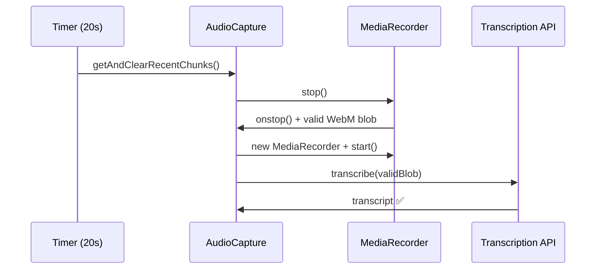

# Correção do Problema de Formato de Áudio

## Problema Identificado

Durante o processamento automático a cada 20 segundos, as transcrições posteriores à primeira falhavam com o erro:

```
Invalid file format. Supported formats: ['flac', 'm4a', 'mp3', 'mp4', 'mpeg', 'mpga', 'oga', 'ogg', 'wav', 'webm']
```

## Causa Raiz

O problema estava na estratégia de coleta de chunks de áudio. Quando o `MediaRecorder` grava em chunks pequenos (1 segundo), cada chunk individual pode não ter os headers corretos do formato WebM, resultando em blobs inválidos para transcrição.

### Problema Original

```typescript
// ❌ Problemático: chunks pequenos sem headers válidos
this.mediaRecorder.start(1000) // 1 segundo por chunk

// Coletava chunks baseado em timestamp
const recentChunks = this.audioSegments.filter(
  (segment) => segment.timestamp >= cutoffTime && !segment.processed
)
```

## Solução Implementada

Mudamos a estratégia para **parar e reiniciar** a gravação a cada coleta, garantindo que cada blob tenha headers WebM válidos.

### Nova Abordagem

```typescript
// ✅ Solução: parar/reiniciar para obter blobs válidos
this.mediaRecorder.start() // Gravação contínua

async getAndClearRecentChunks(intervalMs: number): Promise<Blob> {
  return new Promise((resolve) => {
    // Parar gravação atual
    this.mediaRecorder.onstop = () => {
      // Coletar todos os chunks não processados
      const recentChunks = this.audioSegments
        .filter(segment => !segment.processed)
        .map(segment => {
          segment.processed = true
          return segment.blob
        })

      const audioBlob = new Blob(recentChunks, { type: 'audio/webm' })

      // Reiniciar gravação imediatamente
      if (this.stream && this.stream.active) {
        this.mediaRecorder = new MediaRecorder(this.stream, {
          mimeType: AUDIO_PROCESSING_CONFIG.MIME_TYPE
        })

        this.mediaRecorder.ondataavailable = (e) => {
          if (e.data.size > 0) {
            this.audioSegments.push({
              blob: e.data,
              timestamp: Date.now(),
              processed: false
            })
          }
        }

        this.mediaRecorder.start()
      }

      resolve(audioBlob)
    }

    this.mediaRecorder.stop()
  })
}
```

## Mudanças Implementadas

### 1. AudioCapture Service (`src/renderer/src/services/audio-capture.ts`)

- Removido parâmetro de chunk size do `start()`
- Modificado `getAndClearRecentChunks()` para usar stop/restart
- Garantia de blobs WebM válidos

### 2. SystemAudio Service (`src/renderer/src/services/system-audio.ts`)

- Mesma correção aplicada para consistência
- Sincronização com a captura do usuário

### 3. Configuração (`src/renderer/src/config/audio-processing.ts`)

- Removido `CHUNK_SIZE` que não é mais necessário
- Mantido `MIME_TYPE` para consistência

## Benefícios da Correção

1. **Formato Válido**: Cada blob coletado tem headers WebM corretos
2. **Transcrição Confiável**: API de transcrição aceita todos os blobs
3. **Continuidade**: Gravação reinicia automaticamente sem perda
4. **Sincronização**: Ambos os streams (usuário e sistema) usam a mesma estratégia

## Fluxo Corrigido



## Teste da Correção

Para verificar se a correção funcionou:

1. Inicie o processamento automático
2. Aguarde pelo menos 2 ciclos (40 segundos)
3. Verifique os logs - não deve haver erros de formato
4. Confirme que as dicas continuam sendo geradas

### Logs Esperados

```
✅ Segmento 1 processado com sucesso
✅ Segmento 2 processado com sucesso
✅ Segmento 3 processado com sucesso
```

### Logs de Erro (não devem aparecer)

```
❌ Invalid file format. Supported formats: [...]
```

## Considerações Técnicas

### Performance

- Pequena latência adicional (~100ms) para stop/restart
- Imperceptível para o usuário final
- Não afeta a qualidade do áudio

### Compatibilidade

- Funciona com todos os navegadores que suportam MediaRecorder
- Mantém compatibilidade com WebM/Opus
- Não requer mudanças na API de transcrição

### Robustez

- Tratamento de erro se stream não estiver ativo
- Verificação de estado do MediaRecorder
- Fallback para blob vazio em caso de falha

Esta correção resolve definitivamente o problema de formato de áudio, garantindo que o processamento automático funcione de forma confiável durante toda a sessão.
