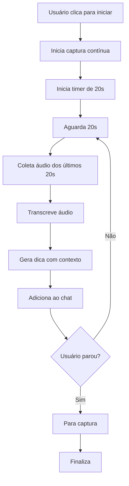
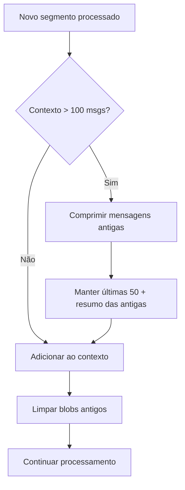
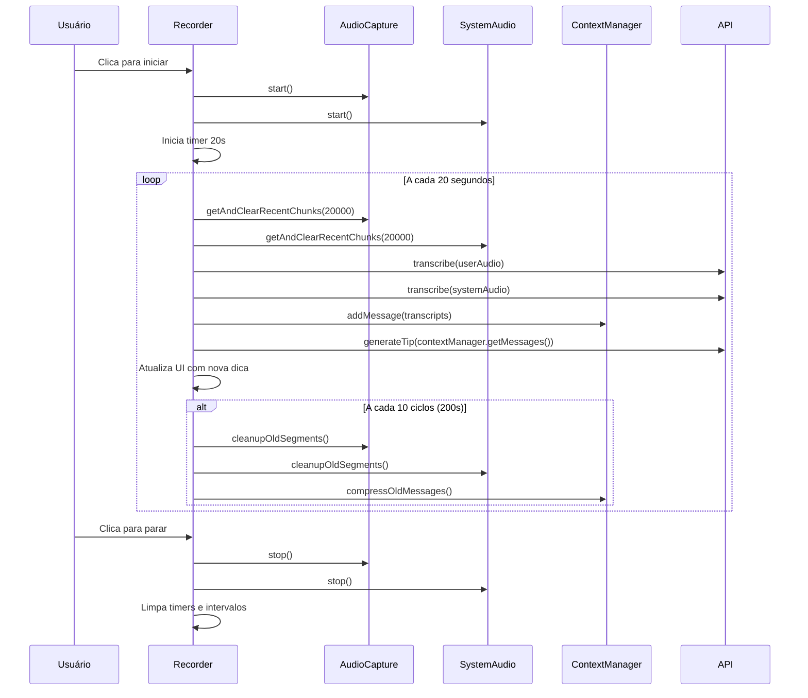

# Plano de Implementação: Captura Automática de Áudio a cada 20s

## Objetivo

Adaptar o sistema atual para capturar e processar áudio automaticamente a cada 20 segundos, gerando dicas contínuas durante reuniões, com gerenciamento eficiente de memória para sessões de 30 minutos a 2 horas.

## Análise da Situação Atual

O sistema atual funciona assim:

1. Usuário clica no botão para iniciar gravação
2. Grava áudio do usuário (microfone) e áudio do sistema simultaneamente
3. Usuário clica novamente para parar
4. Processa todo o áudio capturado, gera uma dica e adiciona ao chat

## Novo Comportamento Desejado

1. Usuário clica para iniciar processamento automático
2. Sistema grava continuamente e a cada 20 segundos:
   - Coleta áudio dos últimos 20s
   - Transcreve áudio do usuário e do sistema
   - Gera dica baseada no contexto acumulado
   - Adiciona nova mensagem ao chat
3. Continua até usuário clicar para parar
4. Gerencia memória automaticamente durante sessões longas

## Estratégia de Gerenciamento de Memória

### Cálculos de Capacidade

Para sessões de 2 horas (120 minutos):

- **Segmentos de áudio**: 120min ÷ 20s = 360 segmentos
- **Tamanho estimado por segmento**: ~200KB (áudio WebM comprimido)
- **Memória total de áudio**: 360 × 200KB = ~72MB
- **Mensagens no contexto**: 360 × 2 = 720 mensagens (user + assistant)

### Limites e Limpeza Automática

```typescript
const MEMORY_LIMITS = {
  MAX_AUDIO_SEGMENTS: 50, // Manter apenas últimos 50 segmentos (~17 min)
  MAX_CONTEXT_MESSAGES: 100, // Limitar contexto para API
  CLEANUP_INTERVAL: 10, // Limpar a cada 10 ciclos (200s)
  MAX_BLOB_SIZE_MB: 50 // Limite total de blobs em memória
}
```

## Fluxo de Processamento Automático



## Sistema de Rotação de Contexto



## Modificações Necessárias

### 1. AudioCapture Service (`src/renderer/src/services/audio-capture.ts`)

**Mudanças principais:**

- Adicionar método `getAndClearRecentChunks(intervalMs: number)`
- Implementar sistema de segmentos com timestamp
- Adicionar limpeza automática de segmentos antigos
- Manter gravação contínua sem interrupção

**Nova estrutura:**

```typescript
export class AudioCapture {
  private mediaRecorder: MediaRecorder | null = null
  private audioSegments: Array<{
    blob: Blob
    timestamp: number
    processed: boolean
  }> = []
  private readonly MAX_SEGMENTS = 50

  async getAndClearRecentChunks(intervalMs: number): Promise<Blob>
  private cleanupOldSegments(): void
  getMemoryUsage(): number
}
```

### 2. SystemAudio Service (`src/renderer/src/services/system-audio.ts`)

**Mudanças principais:**

- Implementar a mesma lógica de coleta periódica do AudioCapture
- Sincronizar com o áudio do usuário
- Adicionar gerenciamento de memória

### 3. Recorder Component (`src/renderer/src/components/recorder.tsx`)

**Mudanças principais:**

- Novo estado `isAutoProcessing` separado de `isRecording`
- Implementar `processingIntervalRef` para controle de 20s
- Implementar limpeza automática de memória
- Modificar interface para mostrar estado de processamento automático

**Novos estados:**

```typescript
const [isAutoProcessing, setIsAutoProcessing] = useState(false)
const [segmentCount, setSegmentCount] = useState(0)
const [memoryUsage, setMemoryUsage] = useState({ audio: 0 })
```

**Novos métodos:**

```typescript
const startAutoProcessing = async () => {
  /* ... */
}
const processAudioSegment = async () => {
  /* ... */
}
const performMemoryCleanup = () => {
  /* ... */
}
```

## Interface do Usuário

### Estados Visuais

- **Parado**: Botão azul normal
- **Processando**: Animação pulsante vermelha/azul contínua
- **Gerando dica**: Indicador adicional de processamento

### Controles

- Um clique: Inicia processamento automático a cada 20s
- Segundo clique: Para processamento e finaliza sessão

### Monitor de Memória (Desenvolvimento)

```typescript
const MemoryMonitor = () => (
  <Box position="absolute" top="0" right="0" fontSize="10px" color="gray">
    Segmentos: {segmentCount} |
    Áudio: {memoryUsage.audio}MB |
    Msgs: {memoryUsage.messages}
  </Box>
)
```

## Fluxo de Dados



## Configurações Ajustáveis

```typescript
const CONFIG = {
  SEGMENT_INTERVAL: 20000, // 20s - intervalo de processamento
  MAX_AUDIO_SEGMENTS: 50, // ~17min de histórico de áudio
  MAX_CONTEXT_MESSAGES: 100, // Limite de mensagens para API
  CLEANUP_INTERVAL: 200000, // 200s entre limpezas de memória
  MEMORY_WARNING_THRESHOLD: 40, // MB - alerta de uso alto
  MIN_AUDIO_SIZE: 4900, // bytes mínimos para processar - remove palavras vazias
  COMPRESSION_THRESHOLD: 80 // Msgs antes de comprimir contexto
}
```

## Tratamento de Erros

1. **Falha na transcrição**: Continua processamento, loga erro
2. **Falha na geração de dica**: Mantém contexto, tenta novamente no próximo ciclo
3. **Memória insuficiente**: Força limpeza adicional, reduz limites temporariamente
4. **Perda de stream**: Tenta reconectar automaticamente

## Benefícios da Implementação

1. **Feedback Contínuo**: Usuário recebe dicas em tempo real durante a reunião
2. **Contexto Progressivo**: Cada dica considera todo o histórico da conversa
3. **Experiência Fluida**: Não precisa lembrar de parar/iniciar manualmente
4. **Melhor Análise**: Segmentos menores permitem análise mais precisa
5. **Memória Controlada**: Sistema estável para sessões longas
6. **Performance Otimizada**: Limpeza automática previne degradação

## Próximos Passos

1. Implementar modificações nos serviços de captura de áudio
2. Criar o ContextManager
3. Atualizar o componente Recorder
4. Testar com sessões de diferentes durações
5. Ajustar configurações baseado nos testes
6. Implementar monitoramento de performance

Este plano mantém a arquitetura atual enquanto adiciona funcionalidade robusta de processamento automático com gerenciamento inteligente de recursos.
